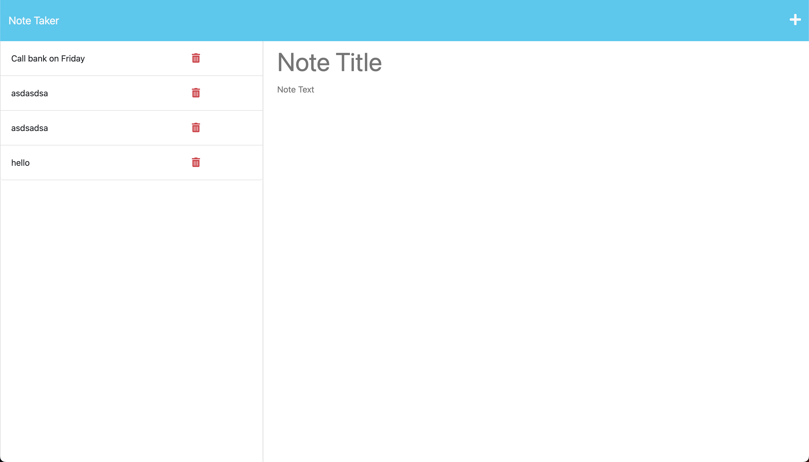

# note-taker

## Description
This app is a simple note taker app to write, save, and store notes on your local host.

## Technologies Used

JavaScript  
Node.js  
Jest  
Express.js  
CSS  
Heroku  

## Installation

No installation, just click link.

## Usage

To use this app, open the provided link. Once you are on the landing page, press "get started" and you will be taken to the notes app. To add a note, press the "+" in the top right hand side of the app. To save, press the save button to the left of the add note button.

## Screenshots

## Link

https://mysterious-thicket-90983-0ba708165240.herokuapp.com/